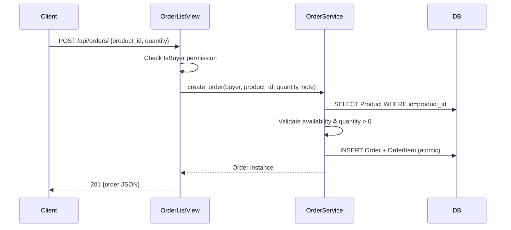
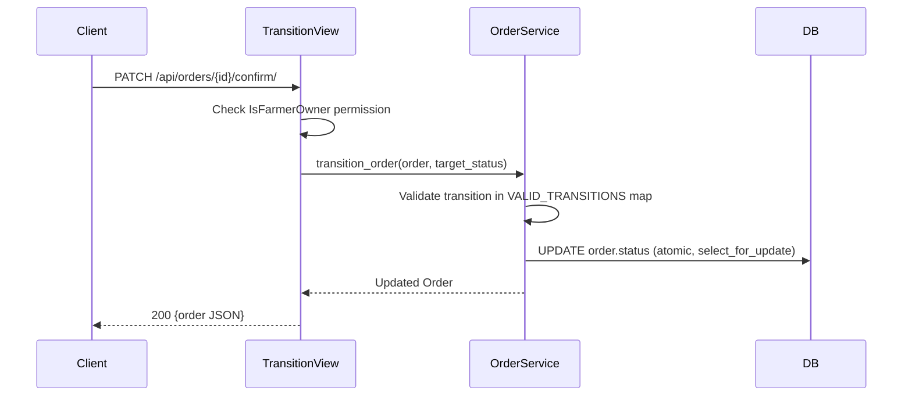
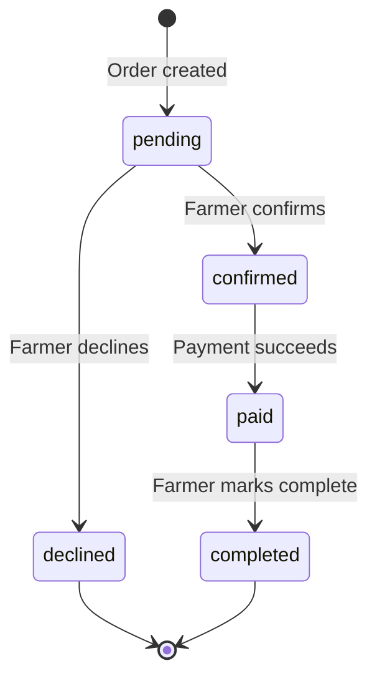

# Design Document: Order Management

## Overview

The Order Management feature implements the core transactional layer of AgroNet. It allows buyers to place orders against farmer product listings and farmers to accept, decline, or complete those orders. The system enforces a strict state machine (`pending → confirmed → paid → completed`, or `pending → declined`) entirely within a service layer, keeping views thin and business logic isolated.

The feature is built on top of the existing Django REST Framework stack with JWT authentication, PostgreSQL, and the custom `User` model already in place. All responses are strict JSON for the mobile client.

---

## Architecture

The feature follows the three-layer architecture mandated by AGENTS.md:

```
HTTP Request
     │
     ▼
┌─────────────────────────────┐
│   Controller Layer          │  orders/views.py
│   (DRF APIViews / Generics) │  — validates HTTP, checks permissions,
│                             │    delegates to service, returns Response
└────────────┬────────────────┘
             │
             ▼
┌─────────────────────────────┐
│   Service Layer             │  orders/services.py
│   (Business Logic)          │  — state machine, price computation,
│                             │    atomic transitions, mark_as_paid()
└────────────┬────────────────┘
             │
             ▼
┌─────────────────────────────┐
│   Repository Layer          │  orders/models.py
│   (Django ORM / PostgreSQL) │  — Order, OrderItem models
└─────────────────────────────┘
```

### Request Flow — Order Creation



### Request Flow — State Transition



### State Machine Diagram



---

## Components and Interfaces

### `orders/models.py`

Defines `Order` and `OrderItem`. No business logic lives here.

### `orders/services.py`

Public interface:

```python
def create_order(buyer: User, product_id: UUID, quantity: Decimal, note: str = "") -> Order: ...
def transition_order(order: Order, target_status: str, actor: User) -> Order: ...
def mark_as_paid(order_id: UUID) -> Order: ...
```

`VALID_TRANSITIONS` constant:
```python
VALID_TRANSITIONS: dict[str, list[str]] = {
    "pending":   ["confirmed", "declined"],
    "confirmed": ["paid"],
    "paid":      ["completed"],
}
```

### `orders/serializers.py`

- `OrderItemSerializer` — nested, read-only fields: `product_id`, `product_title`, `quantity`, `unit_price`
- `OrderSerializer` — full order with nested `items`; read-only: `id`, `buyer`, `farmer`, `total_price`, `status`, `created_at`, `updated_at`
- `OrderCreateSerializer` — write serializer accepting `product_id`, `quantity`, `note`

### `orders/views.py`

| View | Method | URL | Permission |
|---|---|---|---|
| `OrderListView` | GET | `/api/orders/` | `IsAuthenticated` |
| `OrderListView` | POST | `/api/orders/` | `IsBuyer` |
| `OrderDetailView` | GET | `/api/orders/{id}/` | `IsOrderParticipant` |
| `OrderConfirmView` | PATCH | `/api/orders/{id}/confirm/` | `IsOrderFarmer` |
| `OrderDeclineView` | PATCH | `/api/orders/{id}/decline/` | `IsOrderFarmer` |
| `OrderCompleteView` | PATCH | `/api/orders/{id}/complete/` | `IsOrderFarmer` |

### `orders/permissions.py`

- `IsOrderParticipant` — `has_object_permission`: user is `order.buyer` or `order.farmer`
- `IsOrderFarmer` — `has_object_permission`: user is `order.farmer`

---

## Data Models

### `Order`

| Field | Type | Constraints |
|---|---|---|
| `id` | `UUIDField` | PK, default=uuid4, editable=False |
| `buyer` | `ForeignKey(User)` | on_delete=CASCADE, related_name='orders_as_buyer', db_index=True |
| `farmer` | `ForeignKey(User)` | on_delete=CASCADE, related_name='orders_as_farmer', db_index=True |
| `status` | `CharField(20)` | choices=OrderStatus, default='pending' |
| `total_price` | `DecimalField(12,2)` | — |
| `note` | `TextField` | blank=True, max_length=500 |
| `created_at` | `DateTimeField` | auto_now_add=True |
| `updated_at` | `DateTimeField` | auto_now=True |

`OrderStatus` choices: `pending`, `confirmed`, `paid`, `completed`, `declined`

### `OrderItem`

| Field | Type | Constraints |
|---|---|---|
| `id` | `UUIDField` | PK, default=uuid4, editable=False |
| `order` | `ForeignKey(Order)` | on_delete=CASCADE, related_name='items', db_index=True |
| `product` | `ForeignKey(Product)` | on_delete=PROTECT, db_index=True |
| `quantity` | `DecimalField(12,2)` | validators=[MinValueValidator(Decimal('0.01'))] |
| `unit_price` | `DecimalField(12,2)` | validators=[MinValueValidator(Decimal('0.01'))] — snapshot at creation |

`total_price` on `Order` is computed as `sum(item.quantity * item.unit_price for item in items)` and stored at creation time.

### DB Table Names

- `orders` (`db_table = 'orders'`)
- `order_items` (`db_table = 'order_items'`)

---

## Correctness Properties

*A property is a characteristic or behavior that should hold true across all valid executions of a system — essentially, a formal statement about what the system should do. Properties serve as the bridge between human-readable specifications and machine-verifiable correctness guarantees.*

### Property 1: Total price computation

*For any* order created with a valid product and positive quantity, `order.total_price` must equal `quantity × product.price_per_unit` (the snapshotted `unit_price`).

**Validates: Requirements 2.7, 2.8**

---

### Property 2: Only valid state transitions are accepted

*For any* order in any status, requesting a transition to a status not listed in `VALID_TRANSITIONS[current_status]` must leave the order status unchanged and raise an error.

**Validates: Requirements 8.1, 8.2**

---

### Property 3: State machine is strictly sequential — no skipping

*For any* order, the sequence of statuses recorded over its lifetime must be a prefix of one of the two valid paths: `[pending, confirmed, paid, completed]` or `[pending, declined]`.

**Validates: Requirements 8.1, 8.4**

---

### Property 4: Buyer isolation in order listing

*For any* buyer user, the order list endpoint must return only orders where `order.buyer == request.user`, regardless of how many other orders exist in the database.

**Validates: Requirements 3.1**

---

### Property 5: Farmer isolation in order listing

*For any* farmer user, the order list endpoint must return only orders where `order.farmer == request.user`, regardless of how many other orders exist in the database.

**Validates: Requirements 3.2**

---

### Property 6: Unavailable product rejection

*For any* product with `is_available = False`, a buyer's attempt to create an order referencing that product must be rejected with HTTP 400 and the order must not be persisted.

**Validates: Requirements 2.5**

---

### Property 7: Non-positive quantity rejection

*For any* order creation request where `quantity ≤ 0`, the request must be rejected with HTTP 400 and no order must be created.

**Validates: Requirements 2.9**

---

### Property 8: Role-based access — creation restricted to buyers

*For any* authenticated user with `role = 'farmer'`, a POST to `/api/orders/` must return HTTP 403 and no order must be created.

**Validates: Requirements 2.2, 10.2**

---

### Property 9: Ownership enforcement on state transitions

*For any* order and any authenticated user who is not `order.farmer`, a PATCH to confirm, decline, or complete that order must return HTTP 403 and the order status must remain unchanged.

**Validates: Requirements 5.3, 5.5, 7.2, 10.3**

---

### Property 10: mark_as_paid only transitions confirmed orders

*For any* order whose status is not `confirmed`, calling `mark_as_paid(order_id)` must raise an error and leave the order status unchanged.

**Validates: Requirements 6.2**

---

## Error Handling

All errors follow the existing `custom_exception_handler` envelope:

```json
{
  "success": false,
  "error": {
    "status_code": 400,
    "message": "...",
    "details": { ... }
  }
}
```

| Scenario | HTTP Status | Message |
|---|---|---|
| Unauthenticated request | 401 | "Authentication credentials were not provided." |
| Wrong role / not owner | 403 | "You do not have permission to perform this action." |
| Order / Product not found | 404 | "Not found." |
| Invalid quantity (≤ 0) | 400 | "quantity: Ensure this value is greater than 0." |
| Product unavailable | 400 | "This product is not currently available." |
| Invalid state transition | 400 | "Cannot transition order from `{current}` to `{target}`." |
| Serializer validation failure | 400 | Field-level errors map |

Service layer raises `django.core.exceptions.ValidationError` or a custom `OrderTransitionError` (subclass of `ValueError`) for invalid transitions; views catch these and return the appropriate DRF `Response`.

---

## Testing Strategy

### Dual Testing Approach

Both unit/integration tests and property-based tests are required and complementary.

**Unit / Integration tests** (in `backend/tests/`) cover:
- Specific success and failure examples for each endpoint
- All six state machine transitions (4 valid + invalid transition attempts)
- Permission enforcement scenarios (buyer blocked from farmer actions, non-owner blocked)
- `total_price` computation example
- Order listing isolation (buyer sees only their orders, farmer sees only theirs)
- `mark_as_paid` called on non-confirmed order

**Property-based tests** cover the universally quantified properties above.

### Property-Based Testing Library

Use **`hypothesis`** (the standard Python PBT library, already compatible with Django via `hypothesis[django]`).

Each property test must run a minimum of **100 iterations** (Hypothesis default `max_examples=100`).

Each test must be tagged with a comment in this format:
```
# Feature: order-management, Property {N}: {property_text}
```

### Property Test Mapping

| Property | Test name | Hypothesis strategy |
|---|---|---|
| P1: Total price computation | `test_total_price_equals_quantity_times_unit_price` | `st.decimals(min_value=0.01, max_value=9999)` for qty and price |
| P2: Only valid transitions accepted | `test_invalid_transitions_rejected` | `st.sampled_from(OrderStatus)` × `st.sampled_from(OrderStatus)` |
| P3: Sequential state path | `test_status_sequence_is_valid_path` | Sequence of random valid/invalid transition attempts |
| P4: Buyer listing isolation | `test_buyer_sees_only_own_orders` | `st.integers(min_value=1, max_value=10)` for number of buyers/orders |
| P5: Farmer listing isolation | `test_farmer_sees_only_own_orders` | Same as P4 |
| P6: Unavailable product rejection | `test_unavailable_product_order_rejected` | Random product with `is_available=False` |
| P7: Non-positive quantity rejection | `test_non_positive_quantity_rejected` | `st.decimals(max_value=0)` |
| P8: Farmer blocked from creation | `test_farmer_cannot_create_order` | Random farmer user |
| P9: Non-owner blocked from transitions | `test_non_farmer_cannot_transition` | Random user who is not the order's farmer |
| P10: mark_as_paid on non-confirmed | `test_mark_as_paid_rejects_non_confirmed` | `st.sampled_from([pending, paid, completed, declined])` |

### Unit Test Coverage Checklist (maps to Requirement 11)

- [ ] Order creation: success (201)
- [ ] Order creation: 401 unauthenticated
- [ ] Order creation: 403 farmer blocked
- [ ] Order creation: 404 product not found
- [ ] Order creation: 400 unavailable product
- [ ] Order creation: 400 invalid quantity
- [ ] State machine: pending → confirmed
- [ ] State machine: pending → declined
- [ ] State machine: confirmed → paid (via `mark_as_paid`)
- [ ] State machine: paid → completed
- [ ] Invalid transitions: all invalid combos return 400
- [ ] Permission: non-farmer cannot confirm/decline/complete
- [ ] Listing: buyer sees only their orders
- [ ] Listing: farmer sees only their orders
- [ ] `total_price` = `quantity × unit_price` on creation
